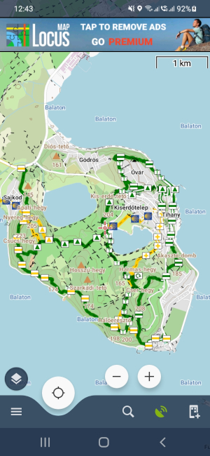
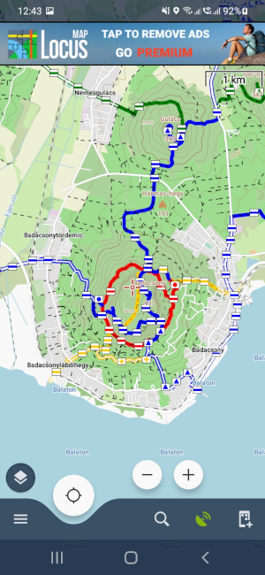
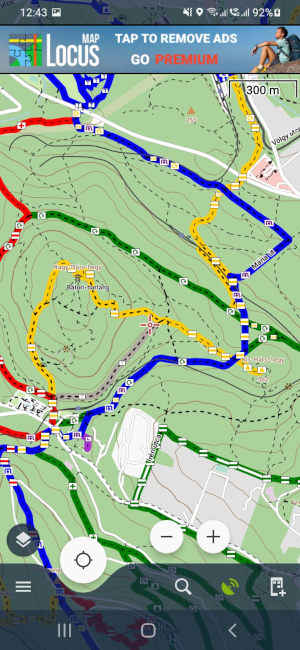
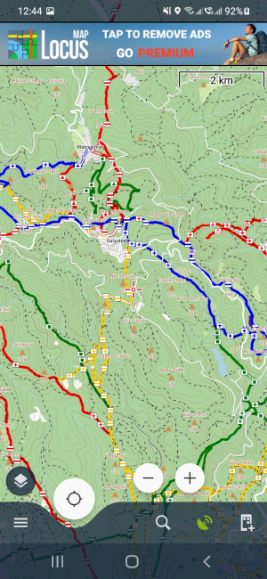

# Locus túratérkép
Offile túratérkép a Locus nevű android aklamazáshoz.





## Telepítés folyamat:
1. A térképfájl felmásolása a telefonon az alábbi mappába  
\Locus\mapsVector
2. Sablon (themes\test.xml és themes\symbol mappa) felmásolása az alábbi mappába:  
\Locus\mapsVector\_themes\test\

## Térkép készítés
Környezet előkészítése, telepítés: TODO
1. Osmosis: https://github.com/mapsforge/mapsforge/blob/master/docs/Getting-Started-Map-Writer.md
2. phyghtmap: http://katze.tfiu.de/projects/phyghtmap/#Download

Térkép létrehozás folyamat:  
1. Osm adatok letöltése innen (osm.pmf):  
https://download.geofabrik.de/europe/hungary.html  

2. Kovertálás (pbf -> osm):  
Opcionálisan az osm fájl is letölthető az előző lépésben   
Budai-hegységre szűrve:  
```
lib\osmosis\bin\osmosis.bat --read-pbf data\hungary-latest.osm.pbf --bounding-box top=47.629478 left=18.89465 bottom=47.453804 right=19.10751 --write-xml data\map.osm
```
Az egész országra/szűrés nélkül:  
```
lib\osmosis\bin\osmosis.bat --read-pbf data\hungary-latest.osm.pbf --write-xml data\map.osm 
```
3. Turistajelzések létrehozása:  

```
lib\transform\Transform.exe --source data\map.osm --target data\map_trailmarks.osm  
```

4. Szintvonalak létrehozása:  
Ide felöltöttem az országra legenerált szintvonalakat:  
https://drive.google.com/file/d/1y1mLppFAjiIo0lO500_bc0fINvLavuWX  
  
Budai-hegységre szűrve:
```
phyghtmap -a 18.89465:47.453804:19.10751:47.629478 -o out_file --write-timestamp --max-nodes-per-tile=0 --max-nodes-per-way=200 --start-node-id=10000000000 --start-way-id=10000000000 --source=srtm1 --srtm-version=3.0
```
Az egész országra:  
```
phyghtmap -a 16.11262:45.73218:22.90201:48.58766 -o out_file --write-timestamp --max-nodes-per-tile=0 --max-nodes-per-way=200 --start-node-id=10000000000 --start-way-id=10000000000 --source=srtm1 --srtm-version=3.0
```

5. Adatok egyesítése
A második paraméternél a phyghtmap által generált fájl nevét kell megadni.

```
lib\osmosis\bin\osmosis.bat --rx data/map.osm --rx data/out_file_lon16.11_22.90lat45.73_48.59_srtm1v3.0.osm --merge --wx data\map_srtm.osm  
```

```
lib\osmosis\bin\osmosis.bat --rx data/map_srtm.osm --rx data/map_trailmarks.osm --merge --wx data\map_srtm_trailmarks.osm  
```

6. Térkép elkészítése:  
A tag-mapping.xml fájl tartalmazza a térkép által támogatott elemeket. Az új elemeket ide kell felvenni.

```
lib\osmosis\bin\osmosis.bat --read-xml data\map_srtm_trailmarks.osm --mw file=data\final.map tag-conf-file=tag-mapping.xml
```
